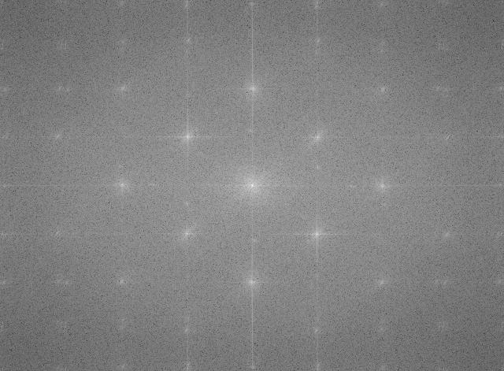
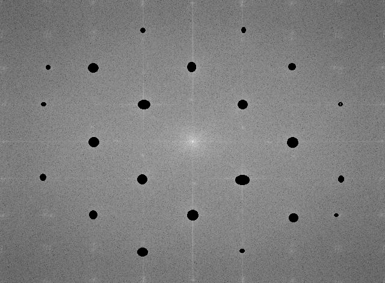
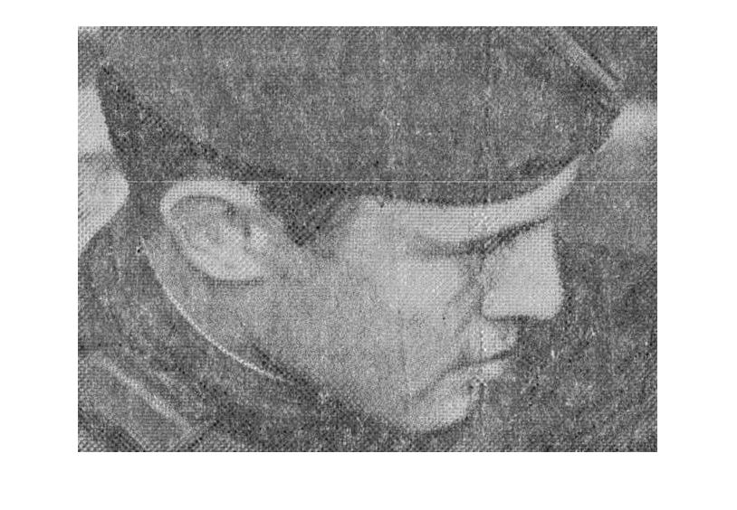

# Notch-Filter
### This is Notch filtering on image with matlab.
:point_down:In this example I work on this picture: 

  

In this practice I work on this picture and finally we filtering in images and at final you will see the result as good and usefull picture as picture without noising on this
then when we the program is paused in the middle of the script you should use paint to use it and you should dark the white places that shows as 
light star.  

### Before removing noise:

### After removing noise:
 

Finally when you put any key to continue your action of your code you should see this resualt :

  

:memo:**_Author: Kianoush NasrAzadani_**
